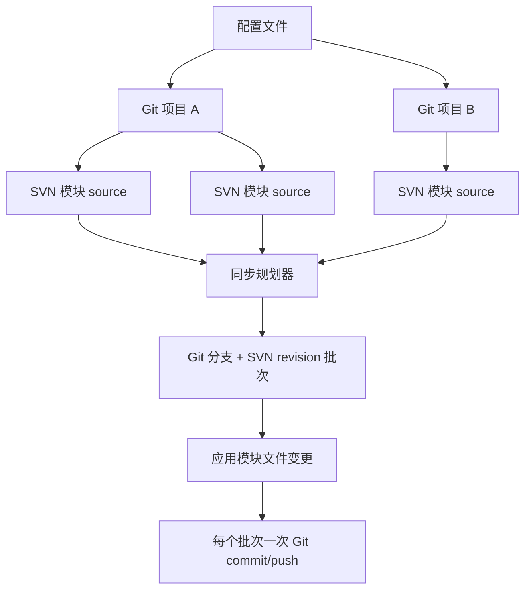
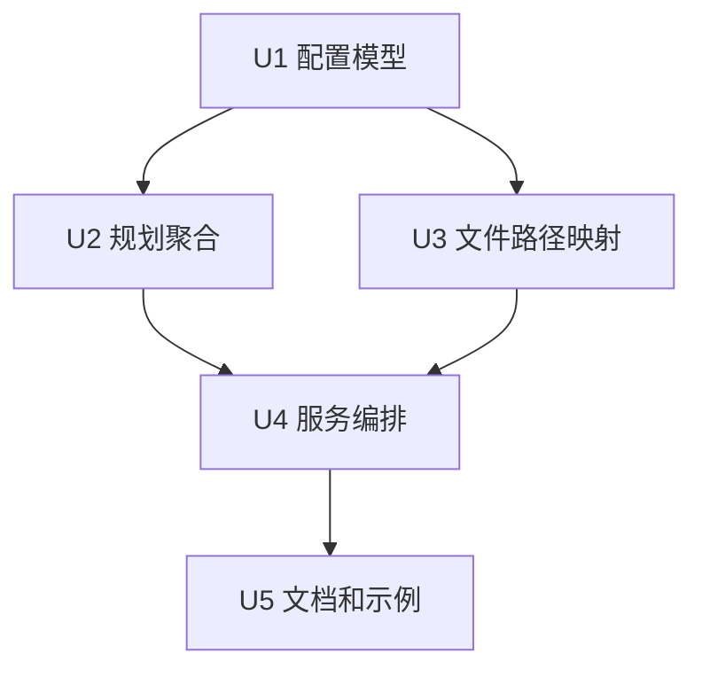

# feat: 将 SVN 模块合并到 Git 项目

## 摘要

本计划将同步模型从“SVN 模块变成 Git submodule”纠正为“一个目标 Git 项目包含多个普通目录形式的 SVN 模块来源”。每个配置的 Git 项目拥有自己的本地路径和可选的顶层 Git 远程地址；每个 SVN 模块拥有自己的来源路径、分支规则、目标路径和分支覆盖规则。

---

## 问题背景

当前实现把 `submodules` 当作真正的 Git submodules：要求每个模块配置 `git_remote_url`，执行 `git submodule add`，把每个模块作为独立 Git target 同步，并提交 `.gitmodules` / submodule 指针。这与目标迁移形态冲突：多个 SVN 模块实际上是一个大项目的组成部分，应该作为普通文件落到同一个完整 Git 仓库里。

---

## 需求

- R1. 单个配置文件必须支持多个目标 Git 项目。
- R2. 每个目标 Git 项目必须支持多个 SVN 模块/source，并同步到同一个 Git 工作树。
- R3. Git 远程地址必须是顶层 Git 项目的属性，而不是模块级属性。
- R4. SVN 模块不得创建或更新 Git submodules、`.gitmodules` 或 submodule 指针提交。
- R5. 现有分支识别、`branch_overrides`、`branch_name` 和 `dir_suffix` 行为必须继续能在每个 SVN 模块上使用。
- R6. 同一个 SVN revision 同时修改同一 Git 项目内多个模块时，必须避免重复提交或跳过提交。
- R7. 文件同步必须安全地把模块相对 SVN 路径映射到配置的 Git 项目目标路径。
- R8. 文档和示例配置必须解释纠正后的模型，并停止把 SVN 模块描述为 Git submodules。

---

## 范围边界

- 本计划只覆盖 Python 实现及其测试/文档。
- 本计划不把真正的 Git submodule 行为保留为活跃功能。
- 本计划不增加超出本地 Git 命令行为之外的 Git remote 网络可用性验证。
- 本计划不改变 SVN log 获取语义，除非 module/source 规划确实需要。

### 延后到后续工作

- 旧配置迁移助手：后续可以增加一个命令，把旧 `submodules` 配置重写成新的 `modules` 结构。
- Server `repo=all` log 加载边界：当前 server 在没有 log XML 且 `repo=all` 时存在可疑路径；除非实现自然触及该流程，否则先记录为后续风险。

---

## 上下文与研究

### 相关代码和模式

- `svn2git/config.py`：负责 frozen dataclass、配置解析、`dir_regx`/`dir_regex` 兼容，以及 `RepositoryConfig.expand_targets()`。
- `svn2git/planner.py`：构建 `SyncPlan`，按 target 过滤路径，按分支分组，应用 `branch_overrides`，并渲染 dry-run 输出。
- `svn2git/service.py`：当前执行 Git submodule 编排，以及 per-target checkout/add/commit/push。
- `svn2git/files.py`：用 branch regex 和 `dir_suffix` 计算相对路径，然后在 `target.git_path` 下复制/删除文件。
- `svn2git/cli.py`：已经支持 `--repo <name>` 和 `--repo all`，符合多 Git 项目的需求。
- `tests/test_config.py`、`tests/test_sync_plan.py`、`tests/test_sync_service.py`、`tests/test_files.py`：现有行为覆盖需要从 Git submodule 语义更新为合并模块语义。
- `tests/fixtures/application_singularity.yml` 和 `tests/fixtures/svn_log_singularity.xml`：Common `2.13` 与 Framework `platform_2.13 -> 2.13` 的重要 branch override fixture。

### 机构/项目内沉淀

- `README.md` 当前在“Git 子模块映射”章节记录了错误心智模型，这是需要重写的主要文档来源。
- `ULTRAWORK_NOTEPAD.md` 记录了 Singularity branch override 的坑点：必须保留分支级 `svn_url`、`svn_project_path`、`dir_regx`、`dir_suffix`，以及像 `"2.13"` 这样的字符串分支名。
- 本仓库当前没有 `docs/solutions/` 学习沉淀目录。

### 外部参考

- 本计划不需要外部研究。工作内容是围绕 Python dataclass、本地 Git 命令和现有测试的内部配置/模型重构。

---

## 关键技术决策

| 决策 | 理由 |
|---|---|
| 将领域命名从 Git `submodules` 改为 SVN `modules` / sources | 用户需要表达的是同一个 Git repo 内的 SVN source 模块，不是独立 Git 仓库。继续沿用 submodule 命名会保留错误抽象。 |
| 将 `git_remote_url` 放到顶层 repository 配置 | 远程地址属于完整的目标 Git 项目，用于初始化或校验 repo 级 `origin`。 |
| 将每个 SVN 模块表示为带 Git `target_path` 的 source | 模块需要写入目标 Git 工作树内的某个普通目录，而不是嵌套 Git 仓库。 |
| 按 Git project + Git branch + SVN revision 规划和执行，而不是按 module target 执行 | 多个模块可能被同一个 SVN revision 修改，且映射到同一个 Git 分支时必须合并到同一个 Git 提交。 |
| 按 module/source 跟踪 revision checkpoint | 单个 repo 级 `.svn_version` 会导致一个模块跳过另一个模块尚未同步的 revision。模块级 checkpoint 可避免数据丢失。 |
| checkpoint 以配置中的 module/source 身份为 key | revision 状态应该存放在每个 Git 项目内，但作用域必须绑定稳定的配置 module/source 身份，而不是只绑定 Git 分支。 |
| 在规划或应用前检测目标路径冲突 | 重复 module destination root 和计算后的文件目标路径冲突必须显式失败，不能静默覆盖文件。 |
| 旧 Git submodule 行为不纳入本次范围 | 当前行为就是模型错误本身。除非未来显式增加兼容模式，否则兼容性不应继续生成 `.gitmodules`。 |

---

## 未决问题

### 规划中已解决

- 模块级 `git_remote_url` 是否继续必填？不。remote 是顶层 Git 项目的属性。
- 多个 Git 项目是否继续建模为 `svn_git_mapping` 下的多个条目？是。CLI 已经通过 repo name 和 `--repo all` 迭代顶层 repository。
- Common `2.13` 和 Framework `platform_2.13` 是否仍允许落到同一个 Git 分支？是。这是已验证的现有需求，应成为合并模块场景的一等能力。

### 延后到实现阶段

- 移除 submodule 语义后的内部 dataclass 精确命名：实现时决定，但公开 YAML 应使用中性的 module/source 命名。
- Git repo 内 checkpoint 文件名格式：实现时基于稳定的配置 module/source 身份选择安全路径。
- Git remote setup 的精确命令序列：实现时结合 runner/test ergonomics 决定，但保留“已有 remote 不匹配时失败而不是自动覆盖”的行为。

---

## 高层技术设计

> *这用于说明预期方案形态，是给评审看的方向性指导，不是实现规格。实现时应把它当作上下文，而不是逐字照搬的代码。*

关键边界是：Git 操作发生在 Git project 层；SVN update 和路径映射发生在 module/source 层。

---

## 实施单元

### U1. 用 SVN module source 替换 Git submodule 配置

**目标：** 更新配置模型，让每个顶层 repository 表示一个完整 Git 项目，带可选 `git_remote_url`；每个子模块表示一个 SVN source，以及它在该 Git 项目内的目标路径。

**需求：** R1, R2, R3, R4, R5

**依赖：** 无

**文件：**
- 修改：`svn2git/config.py`
- 修改：`tests/test_config.py`
- 修改：`tests/fixtures/application_submodules.yml`
- 修改：`tests/fixtures/application_invalid_submodule.yml`
- 新建：`tests/fixtures/application_modules.yml`，如果继续沿用旧 fixture 名称会造成误导

**方案：**
- 在 `RepositoryConfig` / 展开后的运行时 target 数据里解析 repo 级 `git_remote_url`。
- 用中性的 SVN module 字段替换暗示 Git submodule 的字段。公开 YAML 应优先使用 `modules` 和类似 `target_path` 的目标路径字段。
- 保留每个 module 对 `svn_url`、`dir_regx`/`dir_regex`、`dir_suffix`、`branch_overrides` 的继承和覆盖能力。
- 对旧 `submodules` 配置给出清晰迁移错误；除非后续单独规划兼容模式，否则不要把它当作 alias 接受。

**遵循模式：**
- `svn2git/config.py` 中现有 frozen dataclass 解析模式。
- `dir_regx` 和 `dir_regex` 的现有兼容模式。
- `_required()` 和 `ConfigError` 的现有必填字段错误模式。

**测试场景：**
- Happy path：包含两个顶层 Git project 的配置可解析为两个 repository，每个都有自己的 `git_project_path`、`git_remote_url` 和 modules。
- Happy path：包含 `modules.billing` 和 `modules.reporting` 的 repository 不需要模块级 `git_remote_url` 也能解析。
- Happy path：module 未覆盖时继承父级 `svn_url` / `dir_regx`。
- Edge case：`"2.13"` branch override key 仍保持字符串，`branch_name: "2.13"` 仍映射到 Git 分支 `2.13`。
- Error path：module 缺少 `svn_project_path` 或目标路径时，配置校验失败并给出有用 label。
- Error path：旧 Git-submodule-only 配置被拒绝，并返回有用迁移提示。

**验证：**
- 配置解析测试描述 SVN modules，而不是 Git submodules。
- 没有配置测试要求模块级 `git_remote_url`。

### U2. 围绕 Git project 批次重做同步规划

**目标：** 按目标 Git project、Git branch 和 SVN revision 规划同步，同时保留每个 module 的 SVN source 解析。

**需求：** R1, R2, R5, R6

**依赖：** U1

**文件：**
- 修改：`svn2git/planner.py`
- 修改：`tests/test_sync_plan.py`
- 修改：`tests/fixtures/svn_log.xml`
- 修改：`tests/fixtures/svn_log_singularity.xml`

**方案：**
- 停止把每个 module 当成拥有独立 Git working tree 的 Git target。
- 引入能表达“一个 Git project 中，同一个 SVN revision 和 Git branch 包含多个 module/source 变更”的 planning output。
- 保留来自 `branch_overrides` 的 per-module source 选择能力，让同一个最终 Git 分支可以包含来自不同 SVN URL/workspace 的 source。
- 用显式 module 匹配规则替换基于模块名 substring 的相关性检测。
- 在 service 应用文件前，检测重复 module destination root 和计算后的 destination path 冲突。

**遵循模式：**
- 现有 `PlannedRevision` 对 SVN revision 元信息的表达。
- 现有 `_branch_for_change()`、`_source_for_branches()`、`_branch_names_for_sources()` 行为，但作用域应从 target 调整为 module/source。
- 现有 dry-run `SyncPlan.render()` 模式，但输出应改为 module/source，而不是 submodule。

**测试场景：**
- Happy path：一个 Git project 下两个 SVN modules 的 dry-run plan 渲染一个 Git project 和两个 module/source 条目，不包含 `submodule:` 文案。
- Happy path：`--repo all` 兼容配置包含多个 Git project，每个 project 独立规划。
- Integration：同一个 SVN revision 同时修改 billing 和 reporting 时，为该 revision/branch 生成一个 commit batch。
- Integration：Common `2.13` 和 Framework `platform_2.13` 使用不同 SVN source，但最终 Git 分支都是 `2.13`。
- Edge case：路径包含某个 module name substring，但不匹配该 module 配置规则时，不会被该 module 消费。
- Error path：两个 module 的 destination root 重复，或计算后的文件 destination 冲突时，在复制文件前抛出规划错误。

**验证：**
- 同步规划测试证明 Git project 执行上下文是单数，module source 上下文是复数。
- dry-run 输出不使用 Git submodule 词汇也能被理解。

### U3. 给文件同步增加 module 目标路径映射

**目标：** 把 SVN module 文件复制/删除到同一个 Git working tree 内的普通目录，并安全组合 branch regex stripping、`dir_suffix` 和 module destination path。

**需求：** R2, R5, R7

**依赖：** U1

**文件：**
- 修改：`svn2git/files.py`
- 修改：`tests/test_files.py`

**方案：**
- 使用现有 regex 和 suffix 行为从 SVN changed path 计算 module-relative path。
- 将 module-relative path 加上 module 的 Git destination path；空值或 `.` 表示 Git repo 根目录。
- 保留现有对 `.svn`、`.git`、`.metadata` 的 copy ignore 规则。
- 确保删除操作只作用在计算出的 destination path 下，不能逃逸 Git project 根目录。

**遵循模式：**
- 现有 `FileSynchronizer._relative_path()` branch regex 和 `dir_suffix` 测试。
- `FileSynchronizer._copy()` 和 `_delete()` 的现有复制/删除行为。

**测试场景：**
- Happy path：billing 的 SVN path 映射到 Git repo 内的 `modules/billing/src/app.py`。
- Happy path：`dir_suffix: common` 先去掉重复 `common` 层，再加 destination path。
- Edge case：destination path 为 `.` 时写入 repository root，不添加字面 `.` 路径段。
- Error path：计算出的路径尝试逃逸 Git repo root 时，被安全拒绝或忽略。
- Integration：删除 billing 文件只删除 billing 目标路径下的文件，不影响 reporting 下同名文件。

**验证：**
- 文件同步测试证明 copy 和 delete 都尊重 module destination path。
- Singularity Common 风格路径的 suffix 行为仍有覆盖。

### U4. 用 repo 级 Git 编排替换 Git submodule 编排

**目标：** 在顶层 Git repository 中执行同步批次，设置或校验 repo 级 remote URL，并移除 Git submodule 副作用。

**需求：** R2, R3, R4, R6, R7

**依赖：** U2, U3

**文件：**
- 修改：`svn2git/service.py`
- 修改：`tests/test_sync_service.py`
- 修改：`svn2git/commands.py`，如果 remote 检查需要更丰富的命令结果处理

**方案：**
- 从正常同步中移除 `_ensure_submodule()` 行为和父仓库 `.gitmodules` 指针提交。
- 在应用 revision 前，围绕 `git_project_path` 和 `git_remote_url` 增加 repo 级 setup/validation。
- 对每个 Git branch + SVN revision batch：checkout 分支一次，更新每个参与的 SVN module source，应用所有 module 文件变更，然后 add/commit/push 一次。
- 使用以稳定配置 module/source 身份为 key 的 per-module/source checkpoint，避免一个 module 的高 revision 抑制另一个 module 尚未应用的较低 revision。
- 当已有 Git remote 与配置的 `git_remote_url` 冲突时失败，而不是自动覆盖。

**遵循模式：**
- 现有 `DryRunRunner` / `CommandRunner` 拆分，用于无副作用验证命令序列。
- 现有 `_checkout_branch()` 分支创建行为。
- `CommandRunner.require()` 和 `test_sync_raises_when_mutating_command_fails` 的现有失败传播行为。

**测试场景：**
- Happy path：多 module sync 命令列表不包含 `git submodule`、`.gitmodules` 或 submodule 指针提交命令。
- Happy path：配置顶层 `git_remote_url` 时，dry-run 产生预期 repo 级 remote setup/validation 命令。
- Integration：一个 mixed-module SVN revision 只产生一次目标 Git branch 的 checkout/add/commit/push 序列。
- Integration：Common 和 Framework source 分别对自己的 working copy 执行 `svn update`，随后在 Git 分支 `2.13` 上提交一次。
- Edge case：module A checkpoint 在 revision 100 时，不会导致 module B 跳过 revision 90。
- Error path：已有 Git origin 不匹配时报错且不 push。
- Error path：Git push 失败仍按 runtime error 传播。

**验证：**
- service 测试断言所有 Git submodule 副作用命令都不存在。
- service 测试证明 commit/push 粒度是 repo 级，而不是 module 级。

### U5. 为纠正后的模型重写文档和示例配置

**目标：** 让 README 和示例 YAML 讲清楚纠正后的模型：多个 SVN modules 进入完整 Git projects，Git remote URL 在顶层，没有模块级 Git remote。

**需求：** R1, R2, R3, R4, R8

**依赖：** U1, U2, U4

**文件：**
- 修改：`README.md`
- 修改：`config/application.yml.example`
- 修改：`pyproject.toml`，如果包 metadata 仍提到 Git submodules
- 测试：`tests/test_cli.py`
- 测试：`tests/test_server.py`

**方案：**
- 将文档章节从 Git submodule mapping 改为 SVN module/source mapping。
- 解释 `git_remote_url` 属于目标 Git project，而每个 module 只拥有 SVN source 配置和 Git destination path。
- 更新示例，展示多个 Git project，以及每个 Git project 下多个 SVN modules。
- 移除关于 sync 会创建 Git submodules 或提交 `.gitmodules` 的描述。
- 如果 package description 仍声称支持 Git repositories and submodules，同步更新。

**遵循模式：**
- 现有 README 中文解释风格。
- `config/application.yml.example` 中已有的注释风格。
- 现有 CLI/server 测试对 dry-run 和 route 输出字符串的断言方式。

**测试场景：**
- Happy path：`validate-config` 接受纠正后的示例配置。
- Happy path：CLI dry-run 输出显示 module destination path 和 repo 级 remote 上下文。
- Edge case：输出不再包含 Git submodule 语言。
- Integration：plan render 术语变更后，server sync response 仍然有用。

**验证：**
- README、示例配置、CLI 输出和测试使用同一套纠正后的词汇。
- 本地 ignored 的 `config/application.yml` 不被提交或覆盖。

---

## 系统级影响

- **交互图：** 配置解析生成 planner 输出，planner 输出进入 service 编排，service 再把 module-specific source/path 数据传给文件同步。
- **错误传播：** 配置错误应继续是 `ConfigError` / CLI exit 2；命令失败应继续通过 `CommandRunner.require()` 抛出 runtime error。
- **状态生命周期风险：** checkpoint 必须从单个 repo 级 `.svn_version` 移到 module/source-scoped 状态，避免跳过 revision。
- **API 表面一致性：** CLI `--repo` / `--repo all` 和 server sync route 应继续适配纠正后的配置结构。
- **集成覆盖：** 单元测试不够；service dry-run 命令序列测试必须证明不再出现 Git submodule 命令。
- **不变约束：** branch override 行为、字符串分支名、`dir_regx` 兼容和 dry-run validation 应保持不变。

---

## 风险与依赖

| 风险 | 缓解 |
|------|------|
| 旧 submodule 命名只是薄薄改名，旧行为仍保留 | 测试必须断言不存在 `git submodule`、`.gitmodules` 和 module-level remote。 |
| mixed-module revision 产生重复 commit 或 push | 围绕 repo/branch/revision batch 规划，并测试同一个 revision 修改多个 module。 |
| 单一 checkpoint 跳过未同步 module | 存储/检查 module-level revision 状态，并测试 module revision 历史不均匀的场景。 |
| destination path 冲突覆盖文件 | 增加 destination-root 和 computed-file 冲突检测，并在文件应用前用失败测试覆盖。 |
| Git remote setup 意外修改用户已有 origin | remote 不匹配时失败，不静默修改。 |
| 文档和配置示例与实现分叉 | 让纠正后的 `application.yml.example` 通过 `validate-config`，并在同一实施单元更新 README。 |

---

## 文档 / 运维备注

- 本地 `config/application.yml` 已被忽略，应继续由用户编辑；实现时只更新 `config/application.yml.example`。
- 因为 commit `f56caaf` 是在本次模型纠正前创建的，而且因网络错误没有推送；未来 push 前应重新检查该提交里的文档。
- GitNexus impact/detect 当前因缺少 `.gitnexus/lbug` 失败；如果实现验证时仍如此，需要记录该限制。

---

## 来源与参考

- 相关代码：`svn2git/config.py`
- 相关代码：`svn2git/planner.py`
- 相关代码：`svn2git/service.py`
- 相关代码：`svn2git/files.py`
- 相关测试：`tests/test_config.py`
- 相关测试：`tests/test_sync_plan.py`
- 相关测试：`tests/test_sync_service.py`
- 相关测试：`tests/test_files.py`
- 相关文档：`README.md`
- 相关配置示例：`config/application.yml.example`
