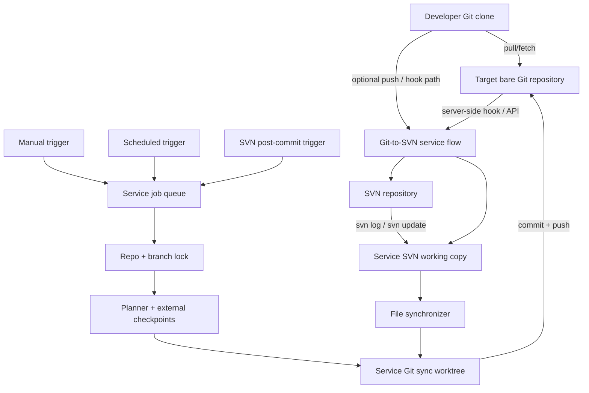

# 将 Svn2Git 重构为专用自动化服务

## 概要

本计划把 Svn2Git 从“会修改开发者可见 Git 工作副本的工具”，迁移为“服务自有的自动化同步流水线”。服务将拥有专用 SVN 工作副本、专用 Git 同步工作树、外部 checkpoint 状态，以及可作为本地 bare repository 的目标 Git 仓库。

推荐架构**不是**直接写入 bare repository。bare repository 没有工作树，不能执行 `git add` / `git commit`；服务应先在私有同步工作树中构造提交，再把结果 push 到开发者 clone 的目标 bare repository。

---

## 问题框架

当前实现混合了三件不同的事：用于同步的 SVN 工作副本、用于构造提交的 Git 工作树，以及开发者日常工作的 Git 仓库。这会让服务变得不安全，因为人可以干扰同步流程依赖的目录；同时也阻止我们把本地 bare repository 作为稳定的 Git 分发点。

目标形态是自动化服务：人只操作普通 Git clone，只有服务拥有同步目录，并由服务更新权威 Git 仓库。

---

## 需求

- R1. 同步服务不能依赖开发者可见的 Git 工作副本，也不能依赖人可编辑的同步目录。
- R2. SVN-to-Git 同步必须通过服务自有 Git 同步工作树写入目标 Git 仓库，包括本地 bare repository。
- R3. 服务必须为每个配置的 SVN source、module 和 branch override 拥有并校验专用 SVN 工作副本。
- R4. checkpoint 状态必须从 Git 工作树中外置，以支持 bare repository 和可丢弃的同步工作树。
- R5. 手动同步、定时同步、hook 触发同步必须共享同一套 job 执行路径和锁模型。
- R6. 现有 module mapping、branch override、`branch_name`、`dir_suffix` 和 `full_sync_interval` 行为必须在重构后保留。
- R7. Git-to-SVN 行为必须针对新的服务架构重新明确定义，不能继续依赖会修改本地 SVN 目录的客户端 hook。
- R8. 计划必须保留当前可测试性模式：command-runner 注入、dry-run 命令记录，以及围绕 config/planner/service/files 的聚焦单元测试。

---

## 范围边界

- 范围内：服务自有路径模型、bare repo 目标模型、同步工作树编排、checkpoint 外置、服务入口、锁、文档、配置示例和测试。
- 范围内：在新架构上保留当前 SVN-to-Git 的模块和分支覆盖行为。
- 范围内：用服务兼容的 Git-to-SVN 方案替换或废弃当前客户端 hook 假设。
- 范围外：立即切换到 `git fast-import`；这是未来优化，不是第一步服务安全迁移路径。
- 范围外：修改 SVN 仓库布局或规范化历史 SVN 分支结构。

### 后续工作

- 完整生产部署打包：Windows service、systemd unit 或 container 安装方式，可在内部服务契约稳定后推进。
- 高级可观测性看板：本计划要求状态/日志基础能力，但不要求完整 UI。
- 通过 `git fast-import` 直接写 bare repo 对象：等同步工作树方案行为正确后，再作为性能项目处理。

---

## 背景与调研

### 相关代码和模式

- `svn2git/config.py` 当前把 `git_project_path` 建模为唯一 Git 路径，并展开为所有 module 的 `SyncTarget.git_path`。
- `svn2git/service.py` 当前假设 `target.git_path` 是普通工作树：checkout 分支、复制文件、执行 `git add`、commit 和 push。
- `svn2git/files.py` 当前把 SVN 文件直接复制到 `target.git_path`，并把 checkpoint 文件写入该工作树。
- `svn2git/planner.py` 当前从 `target.git_path` 读取 `.svn_version`、`.svn_versions` 和 `.svn_full_sync_versions`。
- `svn2git/cli.py` 提供 `validate-config` 和一次性 `sync`；没有 `serve` 命令或 scheduler 入口。
- `svn2git/server.py` 是请求处理函数，不是真正的 HTTP server 或后台 job 系统。
- `hooks/Platform/pre-commit` 和 `hooks/Singularity/pre-commit` 是客户端 hook，会修改本地 SVN checkout、提交到 SVN、调用硬编码 sync URL，然后拒绝 Git commit。
- `hooks/Platform/pre-push` 和 `hooks/Singularity/pre-push` 会拒绝客户端 clone 的直接 Git push。
- `tests/test_sync_service.py` 已使用 fake runner 和 recorder 断言命令序列；需要保留这个测试 seam。
- `tests/test_files.py` 已用临时目录隔离文件同步；需要扩展到同步工作树和外部 checkpoint 状态。
- `docs/plans/2026-06-08-001-feat-merged-svn-modules-plan.md` 记录了重要不变式：SVN module 是一个 Git project 内的普通目录，不是 Git submodule。

### 项目内经验

- 保持边界：Git project 负责 Git 操作；SVN module 负责 source/path mapping。
- 不要重新引入 Git submodule 语义。现有测试断言不存在 `git submodule` 和 `.gitmodules` 副作用。
- Singularity branch override 是关键行为：`svn_url`、`svn_project_path`、`dir_regex`、`dir_suffix` 以及像 `"2.13"` 这样的字符串分支名都必须保持精确。
- 当前没有 `docs/solutions/` 和 `STRATEGY.md`；现有 plan 文档和 README 是持久本地上下文。

### 外部参考

- Git bare repository 是没有工作树的存储仓库；不能作为普通 `git add` / `git commit` 工作流的 cwd。
- `git worktree` 支持一个 repository 关联多个工作树；服务也可以使用指向 bare repository 的普通私有 clone。
- `git fast-import` 可以直接写入 repository，包括 bare repository，但需要构造 Git object/import stream，不应作为第一步迁移方案。

---

## 关键技术决策

- 在 SVN 和目标 bare repository 之间使用服务自有 Git 同步工作树：这样可以保留当前文件复制同步逻辑，同时让 bare repository 成为开发者可见源。
- 把目标 Git 仓库和同步工作树作为两个独立配置概念：`git_repository_path` 或 `git_remote_url` 是权威目标；`git_worktree_path` 是服务私有 scratch/stateful workspace。
- 把 SVN 工作副本视为服务自有 source：`svn_project_path` 仍然是本地工作副本路径，但文档/配置必须说明它不是开发者工作副本。
- 把 checkpoint 移到服务 state 目录：checkpoint 状态不能位于目标 bare repository 或可丢弃同步工作树中。
- 按 repository 和 Git branch 加锁：同一 branch 的 SVN-to-Git、定时同步、手动同步和 Git-to-SVN 流程必须串行；不同 repository 可以独立运行。
- 保持 full-sync interval 逻辑按 target/module/branch 区分：state key 必须包含有效 module/source identity，以及经过 `branch_name` 映射后的最终 Git branch。
- 在依赖 hook 前引入真正的服务入口：当前 `server.py` 只是函数，因此在存在 HTTP 服务或等价 daemon 前，hook-triggered sync 不能算完成。
- 将 Git-to-SVN 重新定义为服务自有行为：客户端 hook 可以生成/配置为兼容方案，但长期模型应由 server-side hook 或 service API 驱动。

---

## 开放问题

### 计划阶段已解决

- 服务是否应直接写入 bare Git repository？否。先使用私有同步工作树；通过 `fast-import` 直接写 bare repo 延后。
- 目标是 bare repo 时是否仍需要专用 Git 同步工作树？需要。bare repository 无法执行普通工作树提交命令。
- 是否应该使用开发者 clone 做同步？否。开发者 clone 由人控制，必须在服务信任边界之外。

### 延后到实现阶段

- 新配置字段的精确命名：实现时选择能清晰表达向后兼容关系的名称，可能对 `git_project_path` 加 deprecation warning。
- HTTP framework 的精确选择：实现时选择最小依赖策略；当前项目没有 web framework 依赖。
- scheduler 的精确实现：服务入口存在后，再决定使用进程内 scheduler 还是外部 scheduled task。
- Git-to-SVN 的 server-side Git hook 模式：验证运维约束后，再决定在 `pre-receive` 阻塞还是在 `post-receive` 入队。

---

## 高层技术设计

> *本节用于说明目标方案，是供 review 使用的方向性指导，不是实现规格。实现 agent 应把它当作上下文，而不是要逐字复现的代码。*



服务拥有 `SvnWorkcopy`、`SyncWorktree`、`Queue`、锁和 checkpoint 状态。开发者只通过自己的 clone 与 `BareRepo` 交互。

---

## 实施单元

### U1. 将配置拆分为 Source、Target、Worktree 和 State 路径

**目标：** 用明确的服务管理路径替换当前含混的 `git_project_path` 模型，同时保留现有配置的迁移路径。

**需求：** R1, R2, R3, R4, R6

**依赖：** 无

**文件：**
- 修改：`svn2git/config.py`
- 修改：`config/application.yml.example`
- 修改：`tests/test_config.py`
- 修改：`tests/fixtures/application_legacy.yml`
- 修改：`tests/fixtures/application_modules.yml`
- 修改：`tests/fixtures/application_singularity.yml`

**做法：**
- 添加明确的 repository 级概念：
  - 目标 Git repository 路径或 URL：开发者 clone 的权威仓库，可为 bare repo。
  - 服务 Git 同步工作树路径：用于 checkout/add/commit 的私有非 bare worktree。
  - 服务 state 路径：checkpoint、锁和 job metadata 的根目录。
- 保留 `svn_project_path` 作为服务自有 SVN 工作副本路径，但更新校验/文档，让所有权明确。
- 暂时接受当前 `git_project_path` 作为 `git_worktree_path` 的 alias，但仅限没有配置目标 bare repo 的情况；输出/规划 validation warning 路径，让现有测试可以安全迁移。
- 保留 module 对 `full_sync_interval`、`dir_regex`、`dir_suffix` 和 branch override 的继承行为。

**执行说明：** 先为当前配置解析写 characterization test，再引入新 alias。

**遵循模式：**
- `svn2git/config.py` 中的 `_required`、`_non_negative_int` 和 alias 解析。
- `tests/test_config.py` 中现有基于 fixture 的配置测试。

**测试场景：**
- Happy path：同时配置 `git_repository_path` 和 `git_worktree_path`，解析出的 repository target 能区分两个路径。
- Happy path：迁移期内只使用 `git_project_path` 的现有配置仍能解析。
- Edge case：module 继承 repository 级 worktree/repository/state 配置，同时保留自己的 SVN source path。
- Edge case：branch override 仍改变 SVN source path 和最终 Git branch，同时使用同一个 repository 级目标 Git repository。
- Error path：目标 repository 和同步 worktree 指向同一路径时校验失败。
- Error path：bare target repository 缺少 sync worktree path 时校验失败。
- Error path：无效 state path 或空 repository path 使用清晰配置标签报错。

**验收：**
- Config object 暴露独立的 source、target、worktree 和 state path。
- 现有 module/branch override fixture 保持有效，或只在计划明确更新 fixture schema 的位置失败。

### U2. 外置 Checkpoint 和 Full-Sync 状态

**目标：** 把 `.svn_version`、`.svn_versions` 和 `.svn_full_sync_versions` 从 Git 工作树迁移到服务自有 state store。

**需求：** R1, R4, R5, R6

**依赖：** U1

**文件：**
- 修改：`svn2git/planner.py`
- 修改：`svn2git/files.py`
- 新建：`svn2git/state.py`
- 修改：`tests/test_sync_plan.py`
- 修改：`tests/test_files.py`
- 新建：`tests/test_state.py`

**做法：**
- 引入小型 state 抽象，用于 processed revision、module revision、full-sync revision、lock metadata，以及可选 last job status。
- state key 按 repository、target/module identity、最终 Git branch，以及 branch override 生效时的有效 SVN source identity 组织。
- 更新 planner，使其从 state 抽象读取 revision，而不是从 `target.git_path` 下的文件系统路径读取。
- 更新 file synchronization，使其返回已应用的 state 信息，但不直接把 checkpoint 文件写入 Git worktree。
- 只有在 service 确认目标 Git repository 更新成功后，才写 checkpoint。

**技术设计：**（方向性指导，不是实现规格）

```text
state root
  repo key
    checkpoints
      target key
        branch key
    full-sync
      target key
        branch key
    jobs
      latest status per repo / branch
```

**遵循模式：**
- `svn2git/planner.py` 中 `_revision_key` 和 `_branch_key` 风格的清洗逻辑，但迁移到共享 state helper。
- 现有无效 checkpoint 行为：不可读或格式错误的值应回退到安全默认值，而不是 crash。

**测试场景：**
- Happy path：planner 会跳过小于等于外部 checkpoint 的 revision。
- Happy path：full-sync interval 使用外部 full-sync state，并且只标记达到阈值的 branch。
- Edge case：缺少 checkpoint state 时，从安全初始 revision 规划。
- Edge case：格式错误的 checkpoint content 不会静默跳过 revision。
- Edge case：兄弟 module 和映射到同一 Git branch 的 branch override 使用不同 state key。
- Integration：service 只有在 Git push/update 成功后才写 checkpoint。
- Error path：file sync 或 Git push 失败时 checkpoint 不变。

**验收：**
- 新的 planner/file synchronizer 行为不依赖 Git worktree 内的 checkpoint 文件。
- 现有 `.svn_version` 行为要么被迁移，要么只作为 legacy input 明确支持。

### U3. 为 Bare Target 和 Sync Worktree 添加 Git Repository Manager

**目标：** 封装所有 Git 操作，在私有 worktree 中构造 commit，并 push 到目标 repository。

**需求：** R1, R2, R5, R8

**依赖：** U1, U2

**文件：**
- 新建：`svn2git/git_repo.py`
- 修改：`svn2git/service.py`
- 修改：`tests/test_sync_service.py`
- 新建：`tests/test_git_repo.py`

**做法：**
- 添加 Git repository manager，负责：
  - 校验目标 repository path 或 URL。
  - 初始化或刷新私有同步 worktree。
  - 确保 `origin` 指向目标 repository。
  - 在同步 worktree 内 checkout 或创建有效 Git branch。
  - 仅在存在 staged changes 时 commit。
  - 将有效 branch push 到目标 repository。
- 避免在 bare target repository 路径中执行 `git checkout`、`git add` 或 `git commit`。
- 通过记录带 cwd 的预期命令保留 dry-run 行为。
- 第一阶段迁移使用持久服务同步 worktree，而不是 ephemeral worktree，以减少大型 repository 的高成本 checkout 抖动。

**遵循模式：**
- `svn2git/commands.py` 中的 `CommandRunner` / `DryRunRunner`。
- `tests/test_sync_service.py` 中现有 service command 断言风格。

**测试场景：**
- Happy path：bare-target 配置在 sync worktree 中执行 checkout/add/commit，并 push 到 bare repository path 或 URL。
- Happy path：缺少 sync worktree 时，从目标 repository 初始化。
- Edge case：目标 repository 中 branch 不存在；sync worktree 创建 branch 并 push。
- Edge case：同步后没有文件变化时，除非显式配置，否则不创建空 commit。
- Error path：target repository path 不是 Git repository 且禁用初始化时，service 在 file sync 前失败。
- Error path：worktree 的 origin remote 与配置目标 repository 不同；service 失败，而不是静默修改。
- Dry-run：命令序列能显示 target repository 和 sync worktree 是不同路径。

**验收：**
- Service tests 不再断言 Git commit 命令发生在开发者可见路径。
- 所有会修改 Git 的命令都通过 repository manager 路由。

### U4. 将文件同步目标改为服务同步 Worktree

**目标：** 让 file copy/delete/full-sync 操作写入服务自有 Git 同步 worktree，同时从服务自有 SVN 工作副本读取。

**需求：** R1, R2, R3, R6

**依赖：** U1, U2, U3

**文件：**
- 修改：`svn2git/files.py`
- 修改：`svn2git/service.py`
- 修改：`tests/test_files.py`
- 修改：`tests/test_sync_service.py`

**做法：**
- 将文件同步 destination 视为 service 传入的显式 worktree root，而不是 `target.git_path`。
- source root 保持为 branch override 解析后的有效 SVN 工作副本路径。
- 保留 `target_path`、`dir_suffix`、module root 行为、安全 destination 检查、`.svn` / `.git` 忽略规则，以及 full-sync reconcile。
- 确保 service state 文件永远不会被复制进 commit，也不会被 full sync 删除。
- 为共享 `target_path: .` 且映射到同一 destination file 的 module 添加碰撞检测。

**遵循模式：**
- `svn2git/files.py` 中的 `_safe_destination`、`_relative_path`、`_source_relative_path` 和 `_destination_path`。
- `svn2git/service.py` 中的重复 target-path 校验。

**测试场景：**
- Happy path：增量同步从服务 SVN 工作副本复制变更文件到服务 Git 同步 worktree。
- Happy path：full sync 将完整 module tree reconcile 到同步 worktree，并删除 mapped destination 下的 stale file。
- Edge case：`target_path: .` 与 Singularity 风格 module 保持现有目录映射，且不会删除无关控制文件。
- Edge case：branch override source path 用于读取文件，最终 Git branch 用于 Git 操作。
- Error path：计算出的 destination 逃逸同步 worktree root 时，在复制前失败。
- Error path：同一 batch 中两个 module 映射到相同 destination file 时，确定性失败。

**验收：**
- 文件同步测试不再需要开发者 checkout 概念。
- Git commit 编排运行前，sync worktree 内容与预期 Git commit 内容一致。

### U5. 引入 Job Runner、锁和统一触发流

**目标：** 让手动、定时和 hook 触发的同步使用同一套 queued + locked 执行路径。

**需求：** R1, R5, R8

**依赖：** U1, U2, U3, U4

**文件：**
- 新建：`svn2git/jobs.py`
- 修改：`svn2git/service.py`
- 修改：`svn2git/server.py`
- 修改：`svn2git/cli.py`
- 新建：`tests/test_jobs.py`
- 修改：`tests/test_server.py`
- 修改：`tests/test_cli.py`

**做法：**
- 添加内部 job model，包含 repo name、可选 target revision、trigger source、dry-run flag 和 status。
- 执行期间按 repository + Git branch 加锁；允许不同 repository 并行。
- 对同一 repo/branch 的重复 queued job 做合并，只保留最高请求 SVN revision。
- 修复 `repo=all` 行为，让每个 repository 加载自己的 SVN URLs；不要读取 `repositories["all"]`。
- server 路径返回 job/status 信息；不要在实际同步执行是同步的情况下声称后台执行。

**遵循模式：**
- `svn2git/server.py` 中的 `handle_sync_request` response object。
- `svn2git/cli.py` 中的 CLI `--repo all` iteration。
- `tests/test_server.py` 和 `tests/test_cli.py` 中的 fake runner/test double 风格。

**测试场景：**
- Happy path：手动 sync 入队/运行一个 job，并返回包含 rendered sync plan 的 status body。
- Happy path：scheduled sync 枚举 repositories，并通过同一 runner 入队。
- Happy path：SVN hook 针对单个 repo/revision 的触发不会重复创建已入队的同 revision job。
- Edge case：没有 log XML 的 `repo=all` 会加载每个 repo 自己的 SVN URLs。
- Edge case：同一 repo/branch 已加锁时，下一个 job 会 queue 或 merge，而不是并发运行。
- Error path：job 失败会记录 status，并保持 checkpoint 不变。
- Dry-run：job path 记录预期 SVN/Git 操作，不写文件。

**验收：**
- 不管触发来源是什么，都只有一条 service execution path。
- 没有任何 trigger 能对同一 repo/branch 并发运行两个 mutating sync。

### U6. 添加真实 HTTP 和 Scheduling 服务入口

**目标：** 把现有 handler 变成可由 hook 和 scheduled job 调用的真实自动化服务 surface。

**需求：** R5, R8

**依赖：** U5

**文件：**
- 修改：`svn2git/server.py`
- 修改：`svn2git/cli.py`
- 修改：`pyproject.toml`
- 新建：`tests/test_server_entrypoint.py`
- 修改：`README.md`

**做法：**
- 添加 `serve` 命令，使用可接受的最小依赖 footprint 启动 HTTP service。
- 暴露 endpoints：
  - 触发单个 repo sync。
  - 触发所有 repo sync。
  - 查询 job status。
  - 如采用，接收 SVN post-commit trigger。
- 在配置后添加 scheduler 支持，但保持 scheduling 可选，让外部 scheduled task 仍可调用 CLI。
- 明确 endpoint 行为：dry-run 或短本地执行返回同步响应；后台执行返回 accepted job response。

**遵循模式：**
- `svn2git/cli.py` 中现有 CLI subcommand 组织方式。
- `tests/test_server.py` 中现有 `Response` object 测试，再扩展到真实 service entry 行为。

**测试场景：**
- Happy path：`serve` 命令校验 config 并启动配置好的 service app object。
- Happy path：repo HTTP trigger 创建 job 并返回 job id/status。
- Happy path：status endpoint 返回 last success revision 和 last failure（如存在）。
- Edge case：未知 repo 返回 404 风格响应，且不修改 state。
- Edge case：`all` trigger 为每个 repository 创建一个 job。
- Error path：无效 config 用清晰消息阻止 service 启动。

**验收：**
- Hook 和 scheduled task 有具体 service URL 或 CLI command 可调用。
- README 不再把 `server.py` 描述成这个单元完成前就已经存在的真实 server。

### U7. 为服务自有目录重新设计 Git-to-SVN Hook Flow

**目标：** 用服务兼容的反向同步模型替换客户端本地 SVN 修改假设。

**需求：** R1, R3, R5, R6, R7

**依赖：** U1, U5, U6

**文件：**
- 修改：`hooks/Platform/pre-commit`
- 修改：`hooks/Singularity/pre-commit`
- 修改：`hooks/Platform/pre-push`
- 修改：`hooks/Singularity/pre-push`
- 新建：`hooks/templates/pre-receive`
- 新建：`hooks/templates/post-receive`
- 新建：`svn2git/reverse_sync.py`
- 新建：`tests/test_reverse_sync.py`
- 修改：`README.md`

**做法：**
- 实现时决定第一个受支持的 reverse-sync mode：
  - 首选 strict mode：server-side `pre-receive` 将 Git commit diff 应用到服务 SVN 工作副本，并在 SVN 失败时拒绝 push。
  - 兼容 mode：保留客户端 hook，但让它们调用 service API，而不是修改开发者本地 SVN 路径。
- 添加 commit marker 防止循环，例如在 SVN commit message 或 service state 中记录来源 Git commit。
- 对 module/branch override 的反向映射，使用 target path 和可选 reverse path rule 选择 SVN 工作副本/source。
- 参数化 service URL 和 repo name；从提交的 hook 脚本中移除硬编码 IP/repo route。
- 明确直接用户 push 策略：要么除了 reverse-sync hook 外阻止直接 push，要么只在 SVN commit 成功后接受 push。

**遵循模式：**
- `hooks/Platform/pre-commit` 和 `hooks/Singularity/pre-commit` 中当前 hook 意图。
- `hooks/Platform/pre-push` 和 `hooks/Singularity/pre-push` 中当前 pre-push 安全消息。

**测试场景：**
- Happy path：影响一个 mapped file 的 Git commit 被应用到正确的服务 SVN 工作副本并提交到 SVN。
- Happy path：push 到带 `branch_name` mapping 的 branch 时，解析到正确 SVN branch override source。
- Edge case：`target_path: .` 需要 reverse mapping rule 来区分 module。
- Edge case：来自服务生成 Git commit 的 commit marker 会被忽略，避免 loopback。
- Error path：SVN commit 失败会拒绝 Git push，或按所选模式报告 failed async job。
- Error path：文件不匹配任何 reverse mapping 时，以有用信息拒绝。
- Integration：Git-to-SVN 成功后会触发或确认 SVN-to-Git sync，且不会创建重复 Git commit。

**验收：**
- 计划不再依赖开发者机器存在指向可变本地 SVN 目录的 `.svn_path`。
- Hook 文档明确说明 hook 放在哪里：兼容模式的 developer clone hook，或新模型的 bare repo server-side hook。

### U8. 更新文档、示例和迁移指南

**目标：** 让新的服务架构易理解且可安全运维。

**需求：** R1, R2, R3, R4, R5, R6, R7

**依赖：** U1, U2, U3, U4, U5, U6, U7

**文件：**
- 修改：`README.md`
- 修改：`config/application.yml.example`
- 新建：`docs/service-architecture.md`
- 新建：`docs/migration-working-tree-to-service.md`

**做法：**
- 围绕服务自有目录重写 Python sync 文档：
  - SVN working copies 由服务拥有。
  - Git sync worktrees 由服务拥有。
  - Git repositories 是开发者 clone/fetch 的目标 repo。
  - Checkpoints 存在 service state 中。
- 添加从当前 `git_project_path` 配置迁移到 target repository + sync worktree 配置的指南。
- 记录如何初始化本地 bare repository 和 sync worktree，但不要让用户手动修改服务自有目录。
- 记录外部 service state 下的 full-sync interval 行为。
- 记录 hook modes 以及当前支持哪个模式。

**遵循模式：**
- 当前 README 配置示例，但重命名概念，让路径所有权无歧义。
- 现有 `config/application.yml.example` 注释风格。

**测试场景：**
- 测试预期：纯文档不需要测试，但 config examples 必须由 `validate-config` 测试覆盖。

**验收：**
- 用户能分清哪些目录开发者可安全操作，哪些目录仅服务可操作。
- 示例配置可以通过 validation。
- 文档不再暗示同步会写入开发者 checkout。

---

## 系统级影响

- **交互图：** CLI、HTTP service、scheduler、SVN hooks、Git hooks、planner、file sync、Git repo manager 和 state store 都收敛到同一 job runner。
- **错误传播：** command failure 必须表现为 job failure，并且不能推进 checkpoint。
- **状态生命周期风险：** checkpoint、锁和 job status 需要具备足够原子性，以承受进程 crash 和 retry。
- **API surface parity：** CLI sync、HTTP trigger 和 scheduled sync 都应支持 repo-specific 和 all-repo 行为。
- **集成覆盖：** service-level tests 必须证明路径已分离：SVN source、Git sync worktree、target bare repository 和 state directory。
- **不变式：** SVN module 仍是一个 Git project 内的普通目录；Git submodule 行为继续排除。

---

## 风险与依赖

| 风险 | 缓解措施 |
|------|----------|
| 意外修改开发者 checkout | 让配置名明确表达所有权，并校验 target repo path 与 sync worktree path 不同。 |
| 对 bare repo 执行工作树模式 Git 操作 | 将 Git commands 集中到 repository manager，并用测试证明 cwd 分离。 |
| checkpoint 过早写入导致 revision 丢失 | 只有目标 Git repo 更新成功后才写 checkpoint。 |
| 并发 trigger 破坏 sync worktree | 按 repo + branch 加锁，并合并重复 job。 |
| Git-to-SVN loop 创建重复 Git commit | 在 reverse sync flow 中加入 origin marker 和 loop detection。 |
| Singularity 根目录 target module 互相覆盖 | 在文件应用前添加 mapping collision check。 |
| `git_project_path` 向后兼容造成概念混乱 | 临时支持 legacy config 并提供 warning/docs，但示例迁移到显式字段。 |
| Service dependency creep | 保持 HTTP/scheduler 实现最小化，延后 packaging/deployment hardening。 |

---

## 已考虑的替代方案

- 使用 `git fast-import` 直接写 bare repository：第一版拒绝，因为这需要用 Git object stream generation 替换现有文件复制同步逻辑。保留为后续性能优化。
- 继续同步到一个持久普通 Git repository，并开放给开发者使用：拒绝，因为这保留了本计划要消除的人为干扰风险。
- 只使用外部 cron 调用现有 CLI：不足，因为 hook 仍需要真实 trigger/status surface，而当前代码缺少 locking/state 语义。
- 继续把客户端 hook 作为唯一 Git-to-SVN 路径：不足，因为它依赖开发者本地 SVN path 和硬编码 service URL。

---

## 分阶段交付

- Phase 1：配置拆分和外部 state store（U1, U2）。
- Phase 2：Git repository manager 和同步 worktree 目标重定向（U3, U4）。
- Phase 3：统一 job runner 和服务入口（U5, U6）。
- Phase 4：Git-to-SVN hook 重设计，以及文档/迁移指南（U7, U8）。

这个顺序先明确最高风险的语义变化，也就是路径所有权，再添加依赖它的自动化入口。

---

## 文档 / 运维备注

- 服务自有目录应记录为禁止人和 Svn2Git 之外自动化修改。
- 对同步项目来说，target bare repository 应是开发者唯一 clone 来源。
- Sync worktree 可为性能保持持久，但应视为可丢弃，并可从 target repository 加 service state 恢复。
- State directory 需要备份，因为 checkpoint 丢失可能导致 replay 或额外 reconcile 工作。
- Hook scripts 必须由 service URL 和 repo key 生成或配置，不能提交硬编码基础设施地址。

---

## 来源与参考

- 相关代码：`svn2git/config.py`
- 相关代码：`svn2git/service.py`
- 相关代码：`svn2git/files.py`
- 相关代码：`svn2git/planner.py`
- 相关代码：`svn2git/cli.py`
- 相关代码：`svn2git/server.py`
- 相关测试：`tests/test_config.py`
- 相关测试：`tests/test_sync_plan.py`
- 相关测试：`tests/test_sync_service.py`
- 相关测试：`tests/test_files.py`
- 相关 hooks：`hooks/Platform/pre-commit`
- 相关 hooks：`hooks/Singularity/pre-commit`
- 先前计划：`docs/plans/2026-06-08-001-feat-merged-svn-modules-plan.md`
